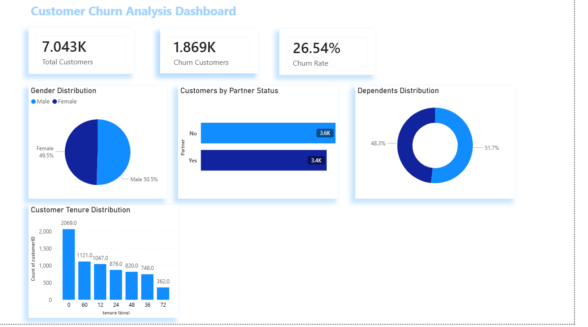
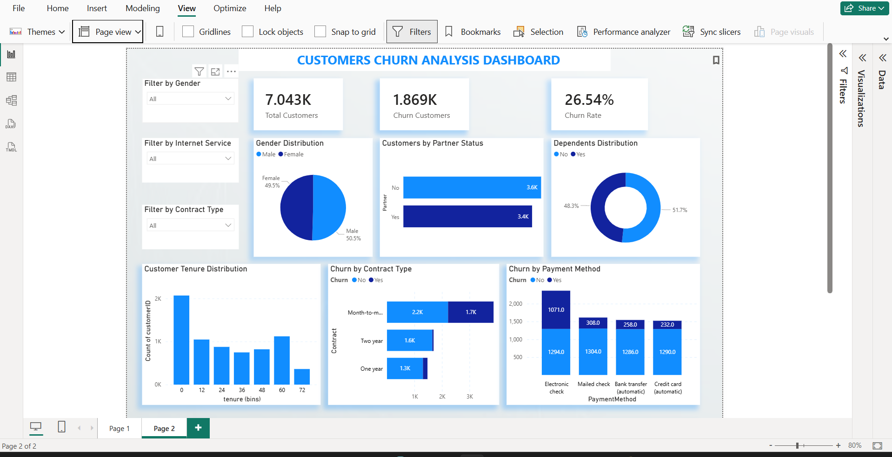

# Customer-Churn-Analysis-PowerBI
Power BI Dashboard - Telecom Customer Churn Analysis | SaiKet Systems Internship
# 📊 Customer Churn Analysis Dashboard
**Power BI Internship Project — SaiKet Systems**

---

## 🔍 Project Overview
Analyzed customer churn for a Telecom company 
using Power BI. Dataset contains 7,043+ customers 
with 21 columns including demographics, services, 
and billing information.

---

## 📈 Key Insights
| Metric | Value |
|--------|-------|
| Total Customers | 7,043 |
| Churn Customers | 1,869 |
| Churn Rate | 26.54% |
| Highest Churn | Month-to-Month contracts |
| Highest Churn Service | Fiber Optic users |

---

## 🛠️ Tools Used
- Power BI Desktop
- Power Query — Data Cleaning
- DAX — Measures & KPIs

---

## 📊 Dashboard Features
- KPI Cards (Total, Churn, Rate)
- Gender Distribution Pie Chart
- Partner Status Bar Chart  
- Dependents Donut Chart
- Customer Tenure Histogram
- Churn by Contract Type
- Churn by Payment Method
- Churn by Internet Service
- Interactive Filters (Gender, Contract, Internet)

---

## 📸 Dashboard Preview

---

## 🏢 Internship
**SaiKet Systems** — Power BI Intern  
Project: Customer Churn Analysis & Prediction
